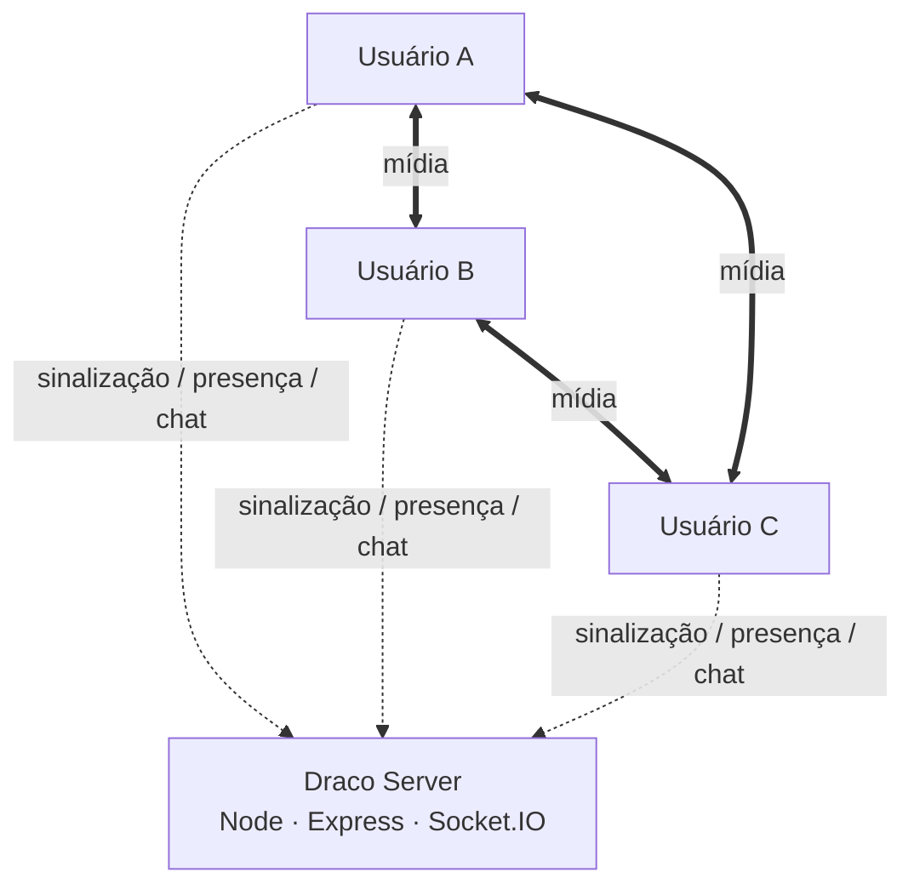
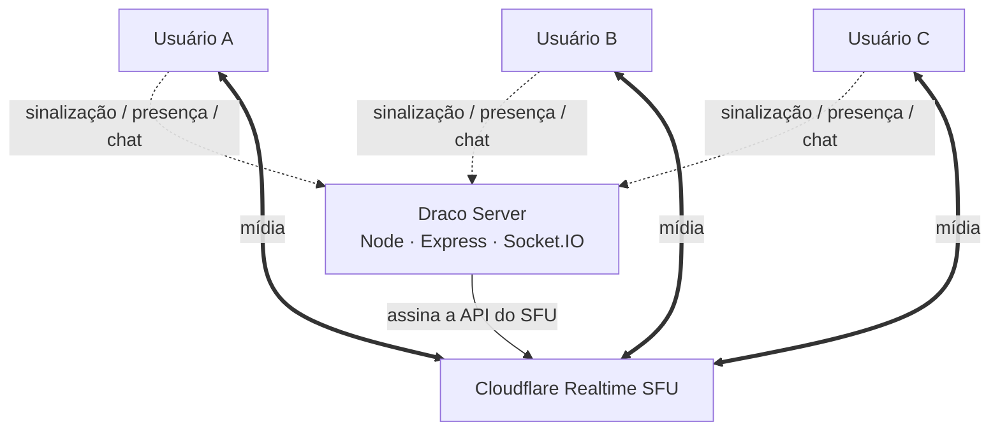

<div align="center">


# Draco

### Call em grupo com voz, câmera e compartilhamento de tela. Simples, rápido e direto.

**Web · Mobile/PWA · Windows Desktop**

[](#)
[](#)
[](#)
[](#)
[](#)

**Servidor oficial:** [dracocall.duckdns.org](https://dracocall.duckdns.org)

**App para Windows:** [baixar Draco 1.0.1](https://github.com/cesar1014/draco/releases/download/v1.0.1/draco-setup-1.0.1.exe) · [notas da versão](https://github.com/cesar1014/draco/releases/tag/v1.0.1)

</div>

---

## Sobre o Draco

O **Draco** é um app de comunicação em tempo real criado com foco no que mais importa durante uma call: **áudio estável, webcam, compartilhamento de tela, controle individual de cada pessoa e uma interface rápida**.

A mesma experiência funciona pelo navegador, no celular e no aplicativo para Windows. No desktop, o Electron adiciona recursos que o navegador sozinho não consegue oferecer da mesma forma, como um seletor próprio de telas e janelas com miniaturas e captura de áudio do sistema no Windows.

O projeto usa **WebRTC** para transportar áudio, câmera e tela. Existem dois caminhos possíveis para a mídia, e quem escolhe é o servidor: **malha direta** entre os participantes, ou **por servidor (SFU)** quando a call é grande. O servidor cuida da sinalização, presença, canais, chat e configuração de conexão.

Contas, servidores, cargos, canais e conversas ficam em **SQLite**, então reiniciar o servidor não apaga o histórico. Cada pessoa entra com e-mail e senha próprios; a sessão é um **token assinado pelo servidor**, e trocar a senha revoga as sessões antigas.

> O objetivo do Draco não é ser uma cópia de outro app. Ele nasceu para ser uma solução própria, leve e focada em calls.

---

## Principais recursos

<table>
<tr>
<td width="50%" valign="top">

### 🎙️ Áudio

- Calls de voz em grupo
- Mute e deafen
- Push-to-talk configurável
- Escolha de microfone e saída de áudio, com prévia antes de entrar na call
- Cancelamento de eco
- Redução de ruído
- Controle automático de ganho
- Indicador de atividade do microfone
- Volume individual de cada pessoa de **0% a 200%**
- Silenciar uma pessoa apenas para você

</td>
<td width="50%" valign="top">

### 📹 Câmera

- Escolha de câmera, com prévia antes de entrar na call
- **360p, 480p, 720p e 1080p**
- **15, 24, 30 ou 60 FPS**
- Espelhamento da própria câmera
- Troca entre câmera frontal e traseira no celular
- Ajuste de qualidade durante a call
- Zoom e movimentação da visualização
- Tela cheia por participante

</td>
</tr>
<tr>
<td width="50%" valign="top">

### 🖥️ Compartilhamento de tela

- Compartilhamento de tela ou janela
- **720p, 1080p ou resolução nativa**
- **15, 24, 30 ou 60 FPS**
- Controle de bitrate por qualidade
- Áudio do sistema no app para Windows
- Seletor próprio com miniaturas no Electron
- Ajustes sem precisar sair da transmissão
- Transmissão começa mesmo se o áudio do sistema falhar

</td>
<td width="50%" valign="top">

### 🌐 Rede e qualidade

- Mídia por servidor (SFU) para calls maiores
- Qualidade adaptativa conforme a banda disponível
- Identidade estável: reconectar volta como a mesma pessoa
- Câmera e tela são reanexadas depois de uma queda
- Reinício de ICE automático quando a rede muda no meio da call
- Credencial de TURN com prazo e renovação, sem ficar presa em STUN
- "Testar minha conexão", com resultado por item
- Estatísticas de latência, perda de pacotes e tráfego
- TURN para redes que bloqueiam conexão direta

</td>
</tr>
<tr>
<td width="50%" valign="top">

### 💬 Experiência

- Criar servidores, canais de voz e texto pela interface
- Convites por link, com validade e limite de usos
- Entrada temporária como visitante, sem acesso para escrever no chat
- Chat em tempo real, com histórico que sobrevive ao restart
- Mensagens privadas, inclusive uma conversa consigo mesmo
- Cargos com permissões de canal, convite, moderação e gerenciamento de cargos
- Conversa anterior carregada ao rolar para cima
- Interface responsiva para desktop e celular
- Tela de Início com servidores, presença separada por servidor e conversas recentes
- PWA para adicionar à tela inicial
- Sons de entrada/saída configuráveis
- Modo leve para PCs mais antigos
- Painel de membros recolhível, separando quem está online de quem está offline

</td>
<td width="50%" valign="top">

### 🔒 Segurança

- Conta individual 18+, com confirmação de senha e senha protegida por scrypt
- Confirmação de e-mail e troca de senha por link de uso único
- Identidade assinada pelo servidor: conhecer o id de alguém não dá acesso à conta dela
- Origem aceita pelo Socket.IO e pelas rotas `/api` restringível
- Limite de tamanho, formato e frequência de eventos
- Rate limit por IP e por identidade, que sobrevive a reconexões
- Cabeçalhos de segurança e CSP compatível com WebRTC
- Segredos permanentes de TURN/SFU ficam no servidor; credencial TURN temporária só é entregue após identificação
- Renderer do Electron isolado e em sandbox

</td>
</tr>
</table>

---

## Como funciona

O Draco tem dois caminhos para a mídia. A sinalização, a presença e o chat passam pelo servidor nos dois casos.

### Malha direta

Cada pessoa conecta com cada pessoa. A mídia não passa por servidor nenhum, que é o caminho mais direto e o mais barato de hospedar.



O custo é o upload de quem transmite: **cada câmera sobe uma vez por ouvinte**. Numa call de seis pessoas, quem liga a câmera está enviando cinco cópias dela. É por isso que, a partir de umas quatro pessoas com vídeo, a internet de casa começa a não dar conta.

### Por servidor (SFU)

Com credenciais do **Cloudflare Realtime** configuradas, a mídia sobe **uma vez** e o servidor replica para todos.



O upload de quem transmite deixa de crescer com o tamanho da call: **1080p para oito pessoas custa a mesma banda que para uma**.

Alguns detalhes do desenho:

- **Duas conexões por pessoa**, uma só de envio e outra só de recepção. Quem entra na call renegocia apenas a de recepção, então a conexão que está carregando a sua tela não é interrompida porque alguém chegou.
- **O navegador nunca fala com a Cloudflare.** O segredo do app fica no servidor: a página pede pelo socket, o servidor assina a chamada, e a resposta volta pelo mesmo caminho.
- **O servidor confere de quem é cada trilha.** Só é possível assinar a câmera de alguém que está no mesmo canal de voz, e da sessão que está no ar, não de uma que já foi descartada.

### Quem escolhe o caminho

O servidor. A escolha vale para todos na sala: se um cliente decidisse sozinho ir de malha, tentaria falar com quem está esperando pelo SFU, e o resultado seria uma call muda sem erro que explicasse o porquê.

**Sem credenciais configuradas, nada muda.** O servidor responde `sfu: false` e as calls seguem em malha direta, exatamente como sempre funcionaram.

### Qualidade adaptativa

O navegador já reduz a qualidade sozinho quando a rede aperta, mas reage devagar e sempre dentro do teto que a gente deu. Se o teto for 4 Mbps numa linha que entrega 1,5, o resultado é uma transmissão travando aos poucos em vez de uma transmissão menor e fluida.

O Draco mexe no teto. Ele observa a perda que o outro lado relata, o tempo de ida e volta e a banda que o navegador estima, e desce em degraus quando a rede não está dando conta. Para **subir** de volta, exige uns 16 segundos de rede calma. Teto que oscila a cada amostra produz vídeo que respira, e isso incomoda mais que vídeo menor e estável.

A barra de voz avisa quando a qualidade está reduzida.

### TURN

Quando uma conexão direta não é possível por causa da rede, NAT ou firewall, o Draco pode usar um servidor TURN como relay. Vale para os dois caminhos de mídia.

A credencial temporária tem prazo declarado e é renovada antes de vencer, dos dois lados. Se a primeira tentativa falhar, o cliente cai para STUN mas **não fica preso nele**: a próxima entrada em call pede configuração nova, e o servidor tenta o provedor de novo com espera crescente, limitada a cinco minutos. Uma credencial revogada no meio do dia também é descartada em vez de repetida.

### Quando a rede muda no meio da call

Trocar de Wi-Fi para 4G, ou uma oscilação de alguns segundos, não deveria custar a call. O que o Draco faz, em ordem:

1. **ICE apenas desconectado** — espera seis segundos. Isso se resolve sozinho na maioria das trocas de rede, e gastar uma renegociação aqui seria desperdício.
2. **ICE falhou** — reinicia o ICE na conexão afetada, no máximo duas vezes. O envio e a recepção são conexões separadas, então cada uma se recupera sozinha.
3. **Não voltou** — a call é refeita inteira, com configuração de ICE nova.
4. **Ainda não voltou** — aí a interface avisa, em vez de insistir para sempre.

Uma publicação de câmera ou tela não é reaproveitada só porque o objeto local ainda existe. Se o transporte caiu, o transceiver foi encerrado pelo navegador ou o SFU trocou a sessão, ela é **republicada**. É esse o defeito que o ciclo "liga a câmera, desliga, espera, liga de novo" costuma esconder: o `replaceTrack` responde que deu certo, e a imagem não chega do outro lado.

---

## Persistência e identidade

A divisão é simples: **o que faz sentido depois de um restart vai para o SQLite, o que não faz fica na memória.**

| No banco | Na memória |
|---|---|
| contas, perfis e senhas com hash | quem está conectado agora |
| servidores e canais | quem está em qual canal de voz |
| membros e cargos | sessões do SFU, tracks e streams |
| mensagens de canal e privadas | estado de mute, câmera e tela |
| convites, banimentos e rate limit de autenticação | baldes de eventos Socket.IO |
| segredo de assinatura das sessões | |

Presença e mídia não são "estado que se perdeu": eles deixam de ser verdade no instante em que o processo cai, e ressuscitá-los mostraria gente numa call que não existe.

### Servidores e privacidade

O app não vem com servidores de demonstração. Quem entra pela primeira vez começa sem servidor e encontra dois caminhos: criar o seu ou colar um convite. Isso evita colocar todo mundo num espaço público sem dono nem alguém que possa administrá-lo.

Todo servidor nasce privado, com um canal de texto e um de voz, e só quem recebe um convite entra. Isso não é uma regra de permissão à parte — o snapshot que cada cliente recebe é montado a partir dos servidores de que aquela pessoa é membro, então um servidor de que ela não faz parte simplesmente não existe do ponto de vista dela: nem os canais, nem a conversa.

Quem cria é o dono. Ele cria e apaga canais, convida, bane e readmite; os outros membros convidam e podem sair. O último canal de um tipo não pode ser apagado, porque um servidor sem canal de texto não tem onde conversar.

Convites são códigos de dez caracteres, num alfabeto sem vogais e sem os caracteres que se confundem ao ler em voz alta (`0`/`O`, `1`/`I`). Aceitam validade e limite de usos, e gastar um uso acontece na mesma transação que registra a entrada — duas pessoas colando o mesmo convite de uso único no mesmo instante não entram as duas.

### Migrations

Ficam em `server/data/migrations/`, aplicadas em ordem de nome no boot, dentro de uma transação cada. Cada uma guarda o checksum do arquivo: editar uma migration já aplicada faz o servidor **recusar subir**, em vez de deixar o banco de quem rodou a versão antiga silenciosamente diferente do de quem instalou depois.

Todo o SQL vive em `server/data/state-repository.js`. Nada de consulta espalhada por handler de socket, e a interface de `state.js` continua a mesma que a sinalização sempre usou — foi assim que a persistência entrou sem reescrever o resto.

### Histórico do chat

O banco guarda as **5000 mensagens mais recentes** de cada canal. A entrada carrega só as **50 últimas** por canal, porque mandar meses de conversa de todos os canais atrasaria a tela de quem só quer entrar na call. Rolar para cima busca a página anterior, ancorada num id de mensagem em vez de num deslocamento: quem manda mensagem no meio da sua rolagem não faz linhas repetirem nem sumirem.

### Identidade

Cada pessoa tem uma conta com e-mail único, nome único e senha própria. O cadastro exige confirmação da senha e uma idade declarada entre 18 e 120 anos; a idade serve apenas para aplicar a barreira 18+ e não é guardada no banco. A senha é armazenada somente como hash scrypt; confirmação de cadastro, ativação do administrador, troca de senha e autorização de um dispositivo novo usam links de uso único enviados por e-mail. O endereço de rede também não fica em texto puro. A sessão e a credencial derivadora do dispositivo ficam em cookies **HttpOnly, SameSite=Strict e Secure em produção**, fora do alcance do JavaScript.

O segredo de assinatura vem de `SESSION_SECRET`. Em desenvolvimento, na falta dele, um valor é sorteado no primeiro boot e guardado no banco; em produção a variável externa é obrigatória.

O corpo das mensagens é cifrado no SQLite com AES-256-GCM usando `DATA_ENCRYPTION_KEY`, mantida fora do banco. Isso protege o arquivo e os backups contra leitura sem a chave; não é criptografia ponta a ponta, porque o servidor precisa descriptografar para entregar a conversa a quem tem acesso.

---

## A tela

Três colunas no desktop, e a do meio é a que importa: é onde está a conversa ou a call.

**Canais à esquerda.** A coluna é só navegação — servidores, canais de texto e de voz, e quem está em cada call de voz. Nada mais divide espaço com ela.

**Membros à direita, fechado por padrão.** Quem abre é o contador de pessoas do canto superior direito. A lista de quem está no servidor é informação que se consulta de vez em quando ("quem está aí?"), não que se lê o tempo todo, então ela não fica ocupando largura por padrão — e separa quem está online de quem pertence ao servidor mas está offline.

Abrir o painel **encolhe a área de conteúdo** em vez de cobri-la: a conversa se ajusta, e nada fica escondido atrás de uma sobreposição.

**No celular são gavetas.** Não cabem três colunas: os canais entram pela esquerda, os membros pela direita, e o mesmo contador do topo abre e fecha. Um toque fora fecha a que estiver aberta.

### Antes de entrar na call

Escolher o microfone errado é o tipo de erro que só aparece quando alguém já disse "não te ouço". Clicar num canal de voz agora abre uma tela de preparação: seleção de microfone, câmera e saída de som, prévia da própria imagem, medidor que mostra se o microfone capta e um som de teste para a saída.

A prévia abre os dispositivos por conta própria e os fecha ao sair da tela — ela não passa pelo mesmo caminho que a call usa, senão uma câmera de teste continuaria ligada dentro da call de quem entrou com a câmera desligada. Se a câmera estava ligada na prévia, ela entra ligada.

---

## Atualizações do aplicativo

O Draco foi estruturado para que **a maioria das atualizações não obrigue o usuário a baixar outro instalador**.

O aplicativo de Windows funciona como uma camada nativa do Electron em volta da versão web publicada em:

```text
https://dracocall.duckdns.org
```

Isso significa que alterações no React, layout, chamadas, chat e boa parte das funcionalidades chegam ao usuário quando ele **abre ou reinicia o Draco**.

### Quando NÃO precisa baixar outro `.exe`

Normalmente não é necessário reinstalar quando a atualização altera apenas:

- interface e design;
- componentes React;
- canais e chat;
- lógica de WebRTC executada pela página;
- configurações de câmera e tela implementadas no front-end;
- correções no servidor;
- melhorias de desempenho do site;
- recursos que não dependem de uma nova API nativa do Electron.

Basta publicar a nova versão no servidor. Na próxima abertura, o app carrega o código atualizado.

> Ligar o SFU é uma mudança **só de servidor**: são duas variáveis no `.env`. Ninguém precisa baixar nada.

### Quando precisa de uma nova versão do app

É necessário gerar e distribuir um novo instalador quando houver alteração em arquivos ou recursos nativos do desktop, por exemplo:

```text
desktop/main.js
desktop/preload.js
desktop/updater.js
desktop/icon.png
desktop/package.json
```

Alguns exemplos:

- adicionar novas APIs do Electron;
- mudar permissões nativas;
- alterar o seletor de telas/janelas;
- modificar a integração com o Windows;
- trocar o endereço padrão do servidor dentro do app;
- atualizar a versão do Electron por necessidade do aplicativo.

> **Importante:** o app **avisa** quando existe versão nova, mas não substitui a instalação sozinho. A troca do instalador continua sendo um clique da pessoa, no navegador. Instalar um executável de forma automática exige assinatura de código e um canal de release confiável, e sem essas duas coisas o auto-update seria um caminho pronto para instalar qualquer coisa na máquina de quem usa o Draco.

A verificação fica na aba **Conexão** das configurações: ela compara a versão instalada com a última release publicada no repositório e, se houver uma nova, oferece o link. O endereço não vem da página, e sim do processo principal, que só aceita links do próprio repositório de releases.

A **1.0.1 atual** reúne o instalador da versão oficial com as correções finais do Draco v2 e o endurecimento de segurança. O site recebe mudanças de interface e servidor automaticamente; recursos nativos continuam exigindo o instalador novo.

Os builds de teste 1.1.0 e 1.2.0 são tratados explicitamente como anteriores à 1.0.0 oficial. Assim, a aba **Conexão** oferece a release oficial mesmo que o número experimental pareça maior.

---

## Tecnologias

| Camada | Tecnologia |
|---|---|
| Interface | React 19 + TypeScript |
| Build | Vite |
| Estado | Zustand |
| Comunicação em tempo real | Socket.IO |
| Voz, câmera e tela | WebRTC |
| Mídia por servidor | Cloudflare Realtime SFU |
| Processamento de áudio | Web Audio API + Media Capture APIs |
| Servidor | Node.js + Express |
| Persistência | SQLite (better-sqlite3), com migrations |
| Sessão | Token assinado com HMAC-SHA256 |
| Cabeçalhos de segurança | Helmet + CSP própria |
| Desktop | Electron |
| Deploy | Docker / VPS / Oracle Cloud / Fly.io / Render |
| HTTPS | Caddy ou plataforma de hospedagem |
| Relay | coturn / serviço TURN externo |

---

## Estrutura do projeto

```text
Draco/
├── client/                 # aplicação React
│   ├── public/
│   │   ├── brand/          # logos
│   │   └── icons/          # ícones/PWA
│   └── src/
│       ├── components/     # interface
│       ├── rtc/            # engines de mídia
│       │   ├── engine.ts        # contrato comum aos dois caminhos
│       │   ├── VoiceEngine.ts   # malha direta entre navegadores
│       │   ├── SfuEngine.ts     # mídia por servidor
│       │   ├── adaptive.ts      # qualidade adaptativa
│       │   ├── diagnostics.ts   # teste de conexão
│       │   ├── MediaManager.ts  # microfone, câmera e captura de tela
│       │   └── stats.ts         # leitura de getStats
│       ├── state/          # estado global
│       └── dev/            # autotestes
│
├── desktop/                # aplicativo Electron para Windows
│   ├── main.js
│   ├── preload.js
│   ├── updater.js          # verificação de versão
│   ├── status.html
│   └── package.json
│
├── server/                 # Express + Socket.IO
│   ├── index.js
│   ├── signaling.js        # sinalização, presença e eventos sfu:*
│   ├── sfu.js              # cliente da API do Cloudflare Realtime
│   ├── auth.js             # tokens de sessão assinados
│   ├── ice.js
│   ├── log.js
│   ├── security.js
│   ├── state.js            # contrato entre sinalização e estado
│   └── data/
│       ├── database.js         # conexão e migrations SQLite
│       ├── state-repository.js # todo o SQL do estado
│       └── migrations/
│
├── tools/                  # deploy, testes e geração de assets
├── docs/GUIA.md            # guia completo de operação
├── Dockerfile
├── fly.toml
├── render.yaml
└── package.json
```

---

## Rodando localmente

### Requisitos

- **Node.js 24 LTS**
- npm

### Instalação

```bash
npm install
```

### Desenvolvimento

```bash
npm run dev
```

Depois abra:

```text
http://localhost:5173
```

O Vite cuida do front-end e o servidor de desenvolvimento executa a sinalização em paralelo.

---

## Aplicativo para Windows

O desktop usa Electron e continua carregando a mesma aplicação publicada na web.

### Instalar dependências do desktop

```bash
npm run app:install
```

### Abrir o app em desenvolvimento

```bash
npm run app
```

### Abrir apontando para outro servidor

```bash
npm --prefix desktop start -- --url=http://localhost:5173
```

### Gerar o instalador

```bash
npm run app:build
```

O instalador é gerado em:

```text
desktop/out/draco-setup-1.0.1.exe
```

A versão vem de `desktop/package.json`.

### Compartilhamento de tela no desktop

O app tem o próprio seletor de telas e janelas, com miniaturas. Funciona em dois passos porque o `getDisplayMedia` não aceita "quero esta janela" como argumento: quem escolhe é sempre o processo principal.

Duas consequências práticas:

- **Janela fechada entre escolher e compartilhar** dá uma mensagem que explica isso, em vez de uma captura de nada. O processo principal guarda o id da fonte e reconfere se ela ainda existe na hora de conceder.
- **O áudio do sistema depende do loopback do Windows.** No app para Mac ou Linux a opção aparece desligada, dizendo o porquê, já que prometer o som ali resultaria numa transmissão muda. No Windows, quando o pedido de captura sai sem som — o que acontece com a tela inteira em algumas configurações, enquanto a janela de um programa passa —, o app tenta o loopback uma segunda vez por fora do pedido de tela. Se nem assim vier, a transmissão começa muda e o aviso diz qual dos dois casos foi, porque a saída de um deles é compartilhar a janela em vez da tela.

---

## Scripts úteis

| Comando | Função |
|---|---|
| `npm run dev` | inicia cliente e servidor em desenvolvimento |
| `npm run build` | gera o front-end de produção |
| `npm start` | inicia o servidor de produção |
| `npm run lan` | build + servidor HTTPS para testes na rede local |
| `npm run share` | servidor + túnel temporário Cloudflare |
| `npm run app` | abre o Electron |
| `npm run app:install` | instala dependências do desktop |
| `npm run app:build` | gera o instalador Windows |
| `npm test` | typecheck + os quatro conjuntos de teste |
| `npm run test:logic` | testa backoff do TURN, rate limit e nomes |
| `npm run test:server` | testa o protocolo de sinalização e a administração |
| `npm run test:persistence` | testa migrations e persistência após reinício |
| `npm run test:backup` | testa backup, retenção e restauração SQLite |
| `npm run test:media` | testa o ciclo de vida das trilhas no SFU |
| `npm run typecheck` | valida os tipos TypeScript |
| `npm run icons` | recria assets de ícone |

---

## Configuração

Copie o arquivo de exemplo:

```text
.env.example → .env
```

As principais opções são:

```env
PORT=3100
HOST=127.0.0.1
DATABASE_PATH=
BACKUP_RETENTION=7
BACKUP_ENCRYPTION_KEY=
ORIGIN=
SYSTEM_ADMIN_USERNAME=cesar1014
SYSTEM_ADMIN_EMAIL=xcesaryt@gmail.com
APP_URL=https://dracocall.duckdns.org
SMTP_HOST=
SMTP_PORT=587
SMTP_SECURE=0
SMTP_USER=
SMTP_PASS=
EMAIL_FROM=
SESSION_SECRET=
DATA_ENCRYPTION_KEY=
DATA_ENCRYPTION_PREVIOUS_KEYS=
TURNSTILE_SITE_KEY=
TURNSTILE_SECRET_KEY=
TRUSTED_PROXY=0
LOG_LEVEL=

TURN_URL=
TURN_USERNAME=
TURN_PASSWORD=

TURN_CREDENTIALS_URL=
TURN_HOST=
TURN_SECRET=
TURN_ONLY=0

CLOUDFLARE_REALTIME_APP_ID=
CLOUDFLARE_REALTIME_APP_SECRET=

OBJECT_STORAGE_ENDPOINT=
OBJECT_STORAGE_BUCKET=
OBJECT_STORAGE_ACCESS_KEY_ID=
OBJECT_STORAGE_SECRET_ACCESS_KEY=
OBJECT_STORAGE_REGION=auto
OBJECT_STORAGE_USER_QUOTA_BYTES=1073741824
```

Nunca publique credenciais reais no repositório. O `.env.example` explica cada opção em detalhe.

`DATABASE_PATH` aponta o arquivo SQLite, `data/draco.sqlite` por padrão. Em contêiner, monte um
volume persistente nesse diretório — o que fica lá está descrito em
[Persistência e identidade](#persistência-e-identidade).

`SESSION_SECRET` assina os tokens de identidade. Vazio, o servidor sorteia um no primeiro boot e o
guarda no banco, o que basta para uma instância só com disco durável. Preencha quando o disco for
descartável (plano grátis do Render, por exemplo) ou quando houver mais de uma instância: sem isso,
cada uma emitiria tokens que a outra recusaria.

### Backup e restauração do SQLite

`npm run db:backup` cria uma cópia consistente em `backups/` usando a API de backup do SQLite,
inclusive enquanto o banco está em WAL, e a cifra com `BACKUP_ENCRYPTION_KEY`.
`BACKUP_RETENTION` controla quantas cópias permanecem.

Para restaurar, primeiro pare o serviço e execute:

```bash
npm run db:restore -- backups/draco-AAAA-MM-DD.sqlite.enc --confirm-offline
```

O comando verifica a integridade antes e depois e preserva o banco substituído ao lado do arquivo
principal. Reinicie o serviço somente depois da confirmação de sucesso.

`TRUSTED_PROXY=1` faz o limite por IP ler o `x-forwarded-for`. Ligue somente quando houver um proxy
na frente (Fly, Render, Cloudflare, Caddy). Num servidor que recebe conexão direta, qualquer cliente
poderia inventar o cabeçalho e escapar do rate limit trocando o valor.

### Ligando a mídia por servidor

1. No painel da Cloudflare, vá em **Realtime → SFU** e crie uma aplicação.
2. Copie o **App ID** e o **App Secret**.
3. Preencha as duas variáveis no `.env` do servidor e reinicie.

Pronto. As próximas calls entram pelo SFU, e a barra de voz passa a indicar que a mídia está passando por servidor. Para voltar à malha direta, apague as variáveis e reinicie. Nenhum cliente precisa ser atualizado.

---

## Segurança

O desktop aplica algumas proteções importantes:

- `contextIsolation: true`;
- `nodeIntegration: false`;
- sandbox do renderer habilitado;
- permissões liberadas apenas para a origem oficial do Draco;
- navegação fechada na origem do app, inclusive em janelas novas: links externos vão para o navegador do sistema;
- o preload expõe cinco funções: listar fontes de captura, registrar a escolhida, anotar uma falha no console do app, consultar se há versão nova e pedir a abertura da página de release. O endereço a abrir é escolhido pelo processo principal, não pela página;
- a fonte de captura reservada é por janela e com prazo, para que uma escolha não atenda o pedido de outra;
- toda mensagem vinda da página é validada por origem e por tipo antes de virar chamada do Electron.

No servidor:

- **a identidade é assinada pelo servidor.** O navegador guarda um token com HMAC e prazo; conhecer o identificador de outra pessoa não permite mais entrar como ela;
- cabeçalhos de segurança pelo Helmet, com CSP escrita à mão para não quebrar WebSocket, worklet de áudio nem as miniaturas de captura;
- a origem aceita vale para o Socket.IO **e** para as rotas `/api`, e aceita uma lista;
- rate limit por IP antes da entrada e por identidade depois dela, então reconectar não zera as proteções;
- senhas com scrypt e salt aleatório; tokens de confirmação e recuperação ficam no banco somente como SHA-256 e expiram;
- payload de cada evento é validado por tipo e por tamanho; SDP e candidatos ICE são recortados antes de serem repassados;
- credenciais TURN podem ser geradas/obtidas pelo servidor sem expor chaves permanentes no cliente, com prazo, renovação antes do vencimento e retry com backoff limitado;
- o segredo do SFU nunca chega ao navegador: quem assina as chamadas à Cloudflare é o servidor;
- só é possível assinar a trilha de quem está no mesmo canal de voz, e da sessão que está no ar;
- **o que cada pessoa vê vem da associação a servidores, não do que ela pede.** Conhecer o id de um canal não dá acesso a ele: ler, escrever e entrar em voz exigem ser membro do servidor daquele canal, e o chat é entregue à sala do servidor em vez de a todo mundo conectado;
- ações administrativas conferem associação e propriedade antes de tocar no banco, e têm limite próprio de frequência — aceitar convite tem o mais apertado, porque tentar códigos é o único caminho para entrar sem ser convidado.

---

## Testes

`npm test` roda tudo: typecheck e os quatro conjuntos. Nenhum deles precisa de câmera, microfone ou uma segunda pessoa.

### Sinalização

```bash
npm run test:server
```

Sobe o servidor num socket real e verifica entrada com senha, presença, chat, repasse de sinalização, as guardas dos eventos `sfu:*`, limite de frequência e reconexão sem duplicar ninguém na lista, e que a identidade só é reassumida com o token assinado pelo servidor.

Cobre também a administração: um servidor criado é privado, quem não é membro não o administra, o último canal de um tipo não pode ser apagado, convite de uso único não serve duas vezes, e quem foi banido não volta nem com convite válido. **59 testes.**

### Lógica de servidor

```bash
npm run test:logic
```

As regras que erram calado, testadas sem socket nem banco: o backoff do TURN (uma falha inicial não prende a sala em STUN, e a tentativa seguinte espera antes de insistir), o balde de limite (errar a senha esgota as tentativas, acertar não custa nada) e a normalização de nomes de canal e servidor. **8 testes.**

### TypeScript

```bash
npm run typecheck
```

### Persistência

```bash
npm run test:persistence
```

Executa as migrations num banco temporário, grava perfil e mensagens, encerra o processo e confere
o que outro processo consegue levantar. Também valida o schema, a paginação do histórico, que um
canal apagado não volta no boot seguinte, que o segredo de assinatura sobrevive ao reinício e que
presença de call não é persistida.

### Ciclo de vida das trilhas

```bash
npm run test:media
```

Roda o `SfuEngine` fora do navegador, contra um `RTCPeerConnection` de mentira. Cobre o defeito que
mais custa a diagnosticar à mão: ligar a câmera, desligar, esperar e ligar de novo. Verifica que
desligar não gasta negociação, que uma publicação inválida é refeita em vez de reusada, que o
reinício de ICE vai para a conexão certa e para no teto, e que fechar o motor solta temporizadores e
conexões. **9 testes.**

### Autoteste WebRTC

Com o ambiente de desenvolvimento rodando:

```text
http://localhost:5173/?selftest=1
```

Abre duas conexões WebRTC na mesma aba, com microfone e câmera falsos: oscilador no lugar do microfone, canvas no lugar da câmera. Verifica conexão, áudio nos dois sentidos, mute, câmera e tela caindo em trilhas separadas (lendo o pixel do vídeo recebido) e recuperação depois de um reinício de ICE. Não depende de webcam, de permissão nem de uma segunda pessoa. **18 testes**, cerca de 40 segundos.

---

## Deploy

O repositório já possui arquivos para diferentes cenários:

- `Dockerfile`
- `render.yaml`
- `fly.toml`
- `tools/deploy-oracle.sh`

### Oracle Cloud

Com o DuckDNS apontando para o IP público da máquina e o projeto já enviado ao servidor, execute:

```bash
cd draco
bash tools/deploy-oracle.sh dracocall.duckdns.org
```

Em uma atualização, entre na mesma pasta, rode `git pull --ff-only` e execute novamente o comando
acima. O instalador pode ser repetido: ele preserva as chaves existentes, configura `ORIGIN` e
`APP_URL` com o domínio informado e, antes de iniciar o serviço, gera `SESSION_SECRET`,
`DATA_ENCRYPTION_KEY` e `BACKUP_ENCRYPTION_KEY` quando ainda estiverem vazias. O `.env` permanece
fora do Git e recebe permissão `600` no servidor.

As credenciais de SMTP e as duas chaves do Cloudflare Turnstile devem ser adicionadas ao `.env` no
servidor quando esses provedores forem usados. Sem as duas chaves, o Turnstile permanece desativado.

Para produção, o ideal é usar:

- domínio fixo;
- HTTPS válido;
- servidor sempre disponível;
- TURN configurado;
- SMTP configurado para confirmação de conta e troca de senha;
- `ORIGIN` restringindo a origem aceita;
- `NODE_ENV=production`, `APP_URL`, `SESSION_SECRET` e chaves externas de criptografia;
- Turnstile para login/cadastro/recuperação expostos publicamente;
- bucket de anexos privado, com CORS limitado à origem do Draco;
- `TRUSTED_PROXY=1` quando houver proxy na frente;
- `HOST=127.0.0.1` quando Caddy/nginx estiver na mesma máquina;
- volume persistente para o arquivo SQLite;
- credenciais do SFU quando as calls passarem de umas quatro pessoas com vídeo.

O guia detalhado está em [`docs/GUIA.md`](docs/GUIA.md).

---

## Roadmap

O Draco está em desenvolvimento ativo. Alguns caminhos naturais para as próximas versões:

- [x] arquitetura SFU para salas maiores;
- [x] qualidade adaptativa conforme a banda;
- [x] reconexão que devolve som e imagem sem sair e voltar do canal;
- [x] persistência SQLite de perfis, servidores, canais e chat;
- [x] identidade assinada pelo servidor;
- [x] aviso de versão nova no aplicativo Windows;
- [x] tela de configuração de dispositivos antes de entrar na call;
- [x] criar servidores, canais e convites pela interface;
- [x] cargos com permissões por servidor;
- [ ] sobrescritas de permissão por canal (o schema já reserva a tabela);
- [ ] substituição automática do instalador (depende de assinatura de código);
- [ ] camadas simultâneas de qualidade (simulcast), para quem tem banda ver melhor que quem não tem;
- [ ] evolução da experiência mobile;
- [ ] mais controles de áudio e vídeo.

O simulcast está na lista, mas depende de terceiro: a API do Cloudflare Realtime hoje não expõe
seleção de camada por assinante de forma confiável, e publicar várias camadas sem o receptor poder
escolher só gastaria upload. A arquitetura já está preparada para quando isso mudar.

---

## Autor

Desenvolvido por **Cesar**.

O Draco nasceu como um projeto pessoal para transformar uma necessidade real de call em um aplicativo próprio, e continua evoluindo a cada versão.

<div align="center">

### 🐉 Draco

**Fale. Compartilhe. Continue a call.**

</div>
