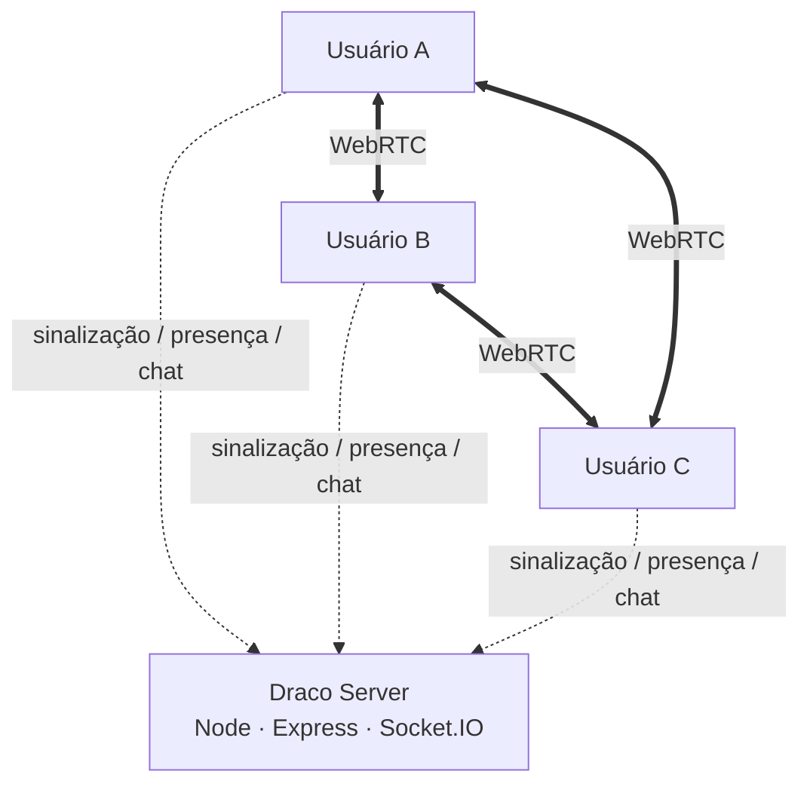

<div align="center">


# Draco

### Call em grupo com voz, câmera e compartilhamento de tela — simples, rápido e direto.

**Web · Mobile/PWA · Windows Desktop**

[](#)
[](#)
[](#)
[](#)
[](#)

**Servidor oficial:** [dracocall.duckdns.org](https://dracocall.duckdns.org)

</div>

---

## Sobre o Draco

O **Draco** é um app de comunicação em tempo real criado com foco no que mais importa durante uma call: **áudio estável, webcam, compartilhamento de tela, controle individual de cada pessoa e uma interface rápida**.

A mesma experiência funciona pelo navegador, no celular e no aplicativo para Windows. No desktop, o Electron adiciona recursos que o navegador sozinho não consegue oferecer da mesma forma, como um seletor próprio de telas e janelas com miniaturas e captura de áudio do sistema no Windows.

O projeto usa **WebRTC** para transportar áudio, câmera e tela diretamente entre os participantes sempre que possível. O servidor cuida da sinalização, presença, canais, chat e configuração de conexão.

> O objetivo do Draco não é ser uma cópia de outro app. Ele nasceu para ser uma solução própria, leve e focada em calls.

---

## Principais recursos

<table>
<tr>
<td width="50%" valign="top">

### 🎙️ Áudio

- Calls de voz em grupo
- Mute e deafen
- Push-to-talk configurável
- Escolha de microfone e saída de áudio
- Cancelamento de eco
- Redução de ruído
- Controle automático de ganho
- Indicador de atividade do microfone
- Volume individual de cada pessoa de **0% a 200%**
- Silenciar uma pessoa apenas para você

</td>
<td width="50%" valign="top">

### 📹 Câmera

- Escolha de câmera
- **360p, 480p, 720p e 1080p**
- **15, 24, 30 ou 60 FPS**
- Espelhamento da própria câmera
- Troca entre câmera frontal e traseira no celular
- Ajuste de qualidade durante a call
- Zoom e movimentação da visualização
- Tela cheia por participante

</td>
</tr>
<tr>
<td width="50%" valign="top">

### 🖥️ Compartilhamento de tela

- Compartilhamento de tela ou janela
- **720p, 1080p ou resolução nativa**
- **15, 24, 30 ou 60 FPS**
- Controle de bitrate por qualidade
- Áudio do sistema no app para Windows
- Seletor próprio com miniaturas no Electron
- Ajustes sem precisar sair da transmissão

</td>
<td width="50%" valign="top">

### 💬 Experiência

- Canais de voz e texto
- Chat em tempo real
- Interface responsiva para desktop e celular
- PWA para adicionar à tela inicial
- Sons de entrada/saída configuráveis
- Modo leve para PCs mais antigos
- Diagnóstico de conexão WebRTC
- Estatísticas de latência, perda de pacotes e tráfego

</td>
</tr>
</table>

---

## Atualizações do aplicativo

O Draco foi estruturado para que **a maioria das atualizações não obrigue o usuário a baixar outro instalador**.

O aplicativo de Windows funciona como uma camada nativa do Electron em volta da versão web publicada em:

```text
https://dracocall.duckdns.org
```

Isso significa que alterações no React, layout, chamadas, chat e boa parte das funcionalidades chegam ao usuário quando ele **abre ou reinicia o Draco**.

### Quando NÃO precisa baixar outro `.exe`

Normalmente não é necessário reinstalar quando a atualização altera apenas:

- interface e design;
- componentes React;
- canais e chat;
- lógica de WebRTC executada pela página;
- configurações de câmera e tela implementadas no front-end;
- correções no servidor;
- melhorias de desempenho do site;
- recursos que não dependem de uma nova API nativa do Electron.

Basta publicar a nova versão no servidor. Na próxima abertura, o app carrega o código atualizado.

### Quando precisa de uma nova versão do app

É necessário gerar e distribuir um novo instalador quando houver alteração em arquivos ou recursos nativos do desktop, por exemplo:

```text
desktop/main.js
desktop/preload.js
desktop/icon.png
desktop/package.json
```

Alguns exemplos:

- adicionar novas APIs do Electron;
- mudar permissões nativas;
- alterar o seletor de telas/janelas;
- modificar a integração com o Windows;
- trocar o endereço padrão do servidor dentro do app;
- atualizar a versão do Electron por necessidade do aplicativo.

> **Importante:** atualmente o projeto não possui um auto-updater nativo para substituir o `.exe`/instalação do Electron. Se uma atualização exigir mudança na parte desktop, será necessário distribuir uma nova versão do instalador.

---

## Como funciona



### Mídia

Microfone, câmera e compartilhamento de tela usam WebRTC. Quando a rede permite, a mídia segue diretamente entre os participantes.

### Sinalização

O servidor usa Socket.IO para coordenar entrada e saída de usuários, canais, ofertas/respostas SDP, candidatos ICE e mensagens do chat.

### TURN

Quando uma conexão direta não é possível por causa da rede/NAT/firewall, o Draco pode utilizar um servidor TURN como relay.

---

## Tecnologias

| Camada | Tecnologia |
|---|---|
| Interface | React 19 + TypeScript |
| Build | Vite |
| Estado | Zustand |
| Comunicação em tempo real | Socket.IO |
| Voz, câmera e tela | WebRTC |
| Processamento de áudio | Web Audio API + Media Capture APIs |
| Servidor | Node.js + Express |
| Desktop | Electron |
| Deploy | Docker / VPS / Oracle Cloud / Fly.io / Render |
| HTTPS | Caddy ou plataforma de hospedagem |
| Relay | coturn / serviço TURN externo |

---

## Estrutura do projeto

```text
Draco/
├── client/                 # aplicação React
│   ├── public/
│   │   ├── brand/          # logos
│   │   └── icons/          # ícones/PWA
│   └── src/
│       ├── components/     # interface
│       ├── rtc/            # engine WebRTC e mídia
│       ├── state/          # estado global
│       └── dev/            # autotestes
│
├── desktop/                # aplicativo Electron para Windows
│   ├── main.js
│   ├── preload.js
│   ├── status.html
│   └── package.json
│
├── server/                 # Express + Socket.IO
│   ├── index.js
│   ├── signaling.js
│   ├── ice.js
│   ├── security.js
│   └── state.js
│
├── tools/                  # deploy, testes e geração de assets
├── docs/GUIA.md            # guia completo de operação
├── Dockerfile
├── fly.toml
├── render.yaml
└── package.json
```

---

## Rodando localmente

### Requisitos

- **Node.js 20.17+**
- npm

### Instalação

```bash
npm install
```

### Desenvolvimento

```bash
npm run dev
```

Depois abra:

```text
http://localhost:5173
```

O Vite cuida do front-end e o servidor de desenvolvimento executa a sinalização em paralelo.

---

## Aplicativo para Windows

O desktop usa Electron e continua carregando a mesma aplicação publicada na web.

### Instalar dependências do desktop

```bash
npm run app:install
```

### Abrir o app em desenvolvimento

```bash
npm run app
```

### Abrir apontando para outro servidor

```bash
npm --prefix desktop start -- --url=http://localhost:5173
```

### Gerar o instalador

```bash
npm run app:build
```

O instalador é gerado em:

```text
desktop/out/draco-setup-1.0.0.exe
```

A versão vem de `desktop/package.json`.

---

## Scripts úteis

| Comando | Função |
|---|---|
| `npm run dev` | inicia cliente e servidor em desenvolvimento |
| `npm run build` | gera o front-end de produção |
| `npm start` | inicia o servidor de produção |
| `npm run lan` | build + servidor HTTPS para testes na rede local |
| `npm run share` | servidor + túnel temporário Cloudflare |
| `npm run app` | abre o Electron |
| `npm run app:install` | instala dependências do desktop |
| `npm run app:build` | gera o instalador Windows |
| `npm run test:server` | testa o protocolo de sinalização |
| `npm run typecheck` | valida os tipos TypeScript |
| `npm run icons` | recria assets de ícone |

---

## Configuração

Copie o arquivo de exemplo:

```text
.env.example → .env
```

As principais opções são:

```env
PORT=3100
ORIGIN=
ROOM_PASSWORD=

TURN_URL=
TURN_USERNAME=
TURN_PASSWORD=

TURN_CREDENTIALS_URL=
TURN_HOST=
TURN_SECRET=
TURN_ONLY=0
```

Nunca publique credenciais reais no repositório.

---

## Segurança

O desktop aplica algumas proteções importantes:

- `contextIsolation: true`;
- `nodeIntegration: false`;
- sandbox do renderer habilitado;
- permissões liberadas apenas para a origem oficial do Draco;
- links externos são enviados ao navegador do sistema;
- o preload expõe somente as funções necessárias para seleção de tela;
- credenciais TURN podem ser geradas/obtidas pelo servidor sem expor chaves permanentes no cliente.

O servidor também limita tamanho e frequência de eventos para reduzir abuso básico na sinalização e no chat.

---

## Testes

### Sinalização

```bash
npm run test:server
```

### TypeScript

```bash
npm run typecheck
```

### Autoteste WebRTC

Com o ambiente de desenvolvimento rodando:

```text
http://localhost:5173/?selftest=1
```

O autoteste cria conexões WebRTC locais para verificar fluxo de áudio/vídeo e comportamento das trilhas sem depender de outra pessoa na call.

---

## Deploy

O repositório já possui arquivos para diferentes cenários:

- `Dockerfile`
- `render.yaml`
- `fly.toml`
- `tools/deploy-oracle.sh`

Para produção, o ideal é usar:

- domínio fixo;
- HTTPS válido;
- servidor sempre disponível;
- TURN configurado;
- `ROOM_PASSWORD` quando a instância não for pública;
- `ORIGIN` restringindo a origem aceita pelo Socket.IO.

O guia detalhado está em [`docs/GUIA.md`](docs/GUIA.md).

---


## Roadmap

O Draco está em desenvolvimento ativo. Alguns caminhos naturais para as próximas versões:

- [ ] auto-update do aplicativo Windows;
- [ ] sistema de versões e releases;
- [ ] persistência opcional do chat;
- [ ] melhorias de reconexão e recuperação de rede;
- [ ] otimizações para chamadas com mais participantes;
- [ ] evolução da experiência mobile;
- [ ] mais controles de áudio e vídeo;
- [ ] futura arquitetura SFU para salas maiores.

---

## Autor

Desenvolvido por **Cesar**.

O Draco nasceu como um projeto pessoal para transformar uma necessidade real de call em um aplicativo próprio — e continua evoluindo a cada versão.

<div align="center">

### 🐉 Draco

**Fale. Compartilhe. Continue a call.**

</div>
