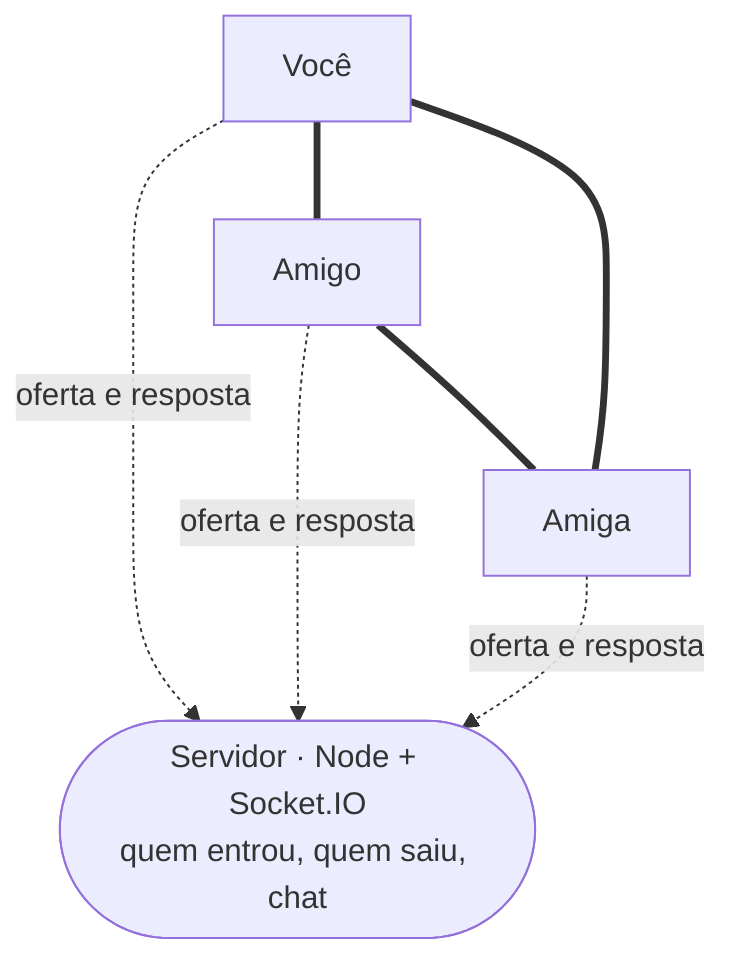

<div align="center">


# Draco

**Voz, webcam e tela compartilhada em grupo — no navegador, no celular e num `.exe` de Windows.**

A mídia vai direto de uma pessoa pra outra. O servidor só apresenta quem é quem.


</div>

---

## De onde veio

Passo o dia no Discord com os amigos, e sempre ficou aquela pergunta: o que exatamente é difícil
ali? Não a lista de emoji nem o cargo de moderador — a call. Entrar num canal e ouvir seis pessoas
ao mesmo tempo, com webcam e tela no meio, sem eco e sem travar.

Draco é a resposta que eu escrevi. Canais de voz e de texto, chat, grade de vídeo, controles de
call — e por baixo o WebRTC na mão, sem SDK de terceiro. É o que eu e meus amigos usamos de
verdade, num servidor de 1 GB em São Paulo que custa zero por mês.

O nome e o dragão vêm daí: era pra ter cara de coisa própria, não de cópia.

---

## Como conversa

Cada pessoa fala direto com cada pessoa. O servidor participa da apresentação e sai de cena — ele
nunca vê áudio nem vídeo, e por isso uma máquina mínima aguenta a sala.



Linha grossa é voz, webcam e tela: ponto a ponto, criptografadas pelo próprio WebRTC. Linha
pontilhada é só combinação — e é a única coisa que passa pelo servidor.

---

## O que dá pra fazer

|  | |
|---|---|
| **Voz em grupo** | canal de voz com detecção de fala, push-to-talk, mudo e ensurdecer |
| **Webcam** | 360p a 1080p, 15 a 60 fps, escolhidos por você — e trocar no meio da call não pisca |
| **Tela** | com o som do sistema junto, resolução e fps ajustáveis enquanto transmite |
| **Volume por pessoa** | de 0 a **200%**, pra quem tem microfone fraco, com limitador contra estouro |
| **Silenciar só pra você** | vale por apelido e continua valendo quando a pessoa voltar |
| **Zoom e destaque** | roda do mouse sobre o vídeo, arrasta pra passear, duplo clique pra tela cheia |
| **Celular** | layout próprio, gaveta de canais e troca entre câmera frontal e traseira |
| **Chat** | mensagens por canal, agrupadas por autor |
| **Diagnóstico** | kb/s, latência e perda por pessoa, e um teste de conexão que mostra os candidatos ICE |

---

## Roda onde

| | Como |
|---|---|
| **Navegador, no PC** | abre o link e entra. Nada pra instalar |
| **Navegador, no celular** | mesmo link; *Adicionar à tela inicial* deixa com cara de app |
| **App de Windows** | instalador `.exe`, dois cliques. Traz seletor de tela com miniaturas e o áudio do sistema junto |
| **Servidor** | qualquer Linux com Node 20+. O meu é uma VM Always Free em São Paulo, com HTTPS e TURN próprios |

O app de desktop é uma janela dedicada em volta do **mesmo site** — não uma segunda versão do
projeto. Corrigi algo no servidor? Quem usa o `.exe` recebe abrindo de novo, sem reinstalar nada.

---

## Por dentro

As decisões que deram mais trabalho, e que são o motivo de a call não engasgar:

- **Nada de renegociar no meio da call.** Cada conexão nasce com quatro canais fixos — microfone,
  câmera, tela e áudio da tela. Ligar a webcam só troca o conteúdo do canal com `replaceTrack`.
  Sem oferta nova, sem SDP novo, sem meio segundo de silêncio.
- **Negociação perfeita.** Duas pessoas entrando no mesmo instante ofertavam ao mesmo tempo e a
  conexão morria. O `perfect negotiation` do WebRTC resolve com papéis de polido e não-polido.
- **Teto de banda por canal.** Malha significa que o seu vídeo sobe uma vez **por pessoa**. Cada
  combinação de resolução e fps tem limite próprio, e o painel mostra a multiplicação antes de
  você começar a transmitir.
- **Tela alheia só decodifica se você pedir.** Chegou tela de 1440p de três pessoas? Você paga
  decodificação de zero — cada uma abre no clique. Foi o que tirou o ventilador do notebook do ar.
- **Volume acima de 100% sem estourar.** Até 100% quem manda é o `<audio>`. Acima disso o som passa
  por um ganho da Web Audio com limitador e volta pro mesmo elemento, que segue escolhendo a saída
  de som e o mudo.
- **Chave de TURN nunca chega ao navegador.** O servidor busca ou assina a credencial e entrega só
  o que expira. Três modos: credencial fixa, credencial em runtime e coturn com HMAC.
- **Detecção de fala em `setInterval`.** Com `requestAnimationFrame` você continuava "falando"
  pros outros ao trocar de janela, porque o navegador congela o rAF em aba de fundo.
- **Avisos sonoros gerados na hora**, com dois osciladores e um envelope. Nenhum mp3 no projeto.
- **Modo leve** e respeito a `prefers-reduced-motion`: as animações do tema desligam sem quebrar
  o layout.

### Provar que funciona sem chamar ninguém

Duas conexões WebRTC de verdade na mesma aba, com oscilador no lugar do microfone e canvas
colorido no lugar da câmera — dá pra **ler o pixel** do vídeo recebido e confirmar que cada trilha
caiu no canal certo, que mutar derruba o nível do outro lado e que ligar a tela não renegocia.

```bash
npm run dev
```

E abrir `http://localhost:5173/?selftest=1`. O protocolo do servidor tem teste próprio, incluindo
as regras de segurança: `npm run test:server`.

---

## Rodar em dois minutos

Precisa de [Node.js](https://nodejs.org) 20 ou mais novo.

```bash
npm install
```

```bash
npm run dev
```

Abra `http://localhost:5173`, escolha um apelido e entre. Para experimentar a call sozinho, abra o
mesmo endereço numa segunda janela anônima com outro apelido e ponha as duas no canal **Geral** —
com fone nos dois lados, ou um microfone capta o som do outro.

O resto — gerar o `.exe`, chamar amigos por um link temporário, publicar com endereço fixo,
configurar TURN, testar no celular pela rede local — está no
**[guia de operação](docs/GUIA.md)**.

---

## Feito com

`React 19` · `TypeScript` · `Vite` · `zustand` · `WebRTC` · `Web Audio` · `Node` · `Express` ·
`Socket.IO` · `Electron` · `Caddy` · `coturn`

Sem banco de dados: canais e mensagens vivem na memória do processo. Identidade é um apelido
guardado no navegador — não há conta nem senha por pessoa, só a senha da sala.

## Limites que eu conheço

Malha P2P é ótima até **6–8 pessoas**; acima disso o upload de cada um cresce demais e o caminho
seria um SFU, que é outro projeto. Reiniciar o servidor apaga o chat. E compartilhar tela **não
existe** em navegador de celular — não é falta minha: nem Chrome no Android nem Safari no iPhone
permitem que uma página capture a tela. No `.exe` e no PC, funciona.
